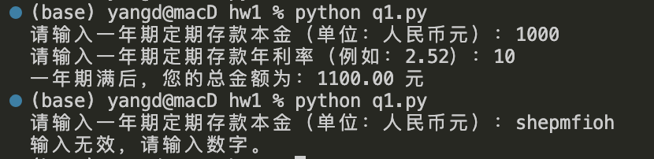
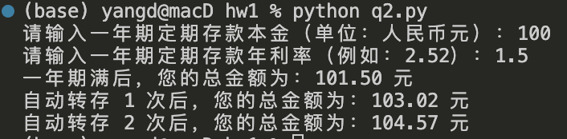
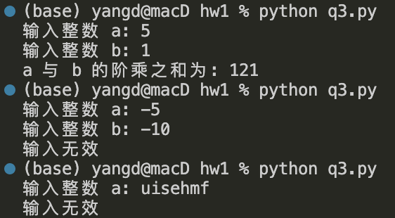

# Python 程序设计基础第一章作业
姓名：阮黄阳
学号：2023080149
## 习题一：
### 题目：
> 编制脚本程序。接受用户输入的两个数。其中一个为一年期定期存款本金，一个为一年期定期存款利率。计算一年期满后本金与利息总额。说明：（1）存款金额以人民币元为单位；（2）输入利率时不需要输入百分号，例如一年期定期存款年利率为2.52%，输入2.52即可。

### 题目思路：
使用input（）输入，print（）输出，定义一个函数来计算一年期满后本金与利息总额

### 实现代码：
    # 定义函数来计算总额
    def calculate_total_amount(principal, interest_rate):
        interest = principal * (interest_rate / 100)
        total_amount = principal + interest
        return total_amount

    # 主程序
    if __name__ == "__main__":
        try:
            # 用户输入本金
            principal = float(input("请输入一年期定期存款本金（单位：人民币元）："))
            
            # 用户输入利率
            interest_rate = float(input("请输入一年期定期存款年利率（例如：2.52）："))
            
            # 计算总额
            total_amount = calculate_total_amount(principal, interest_rate)
            
            # 输出结果
            print(f"一年期满后，您的总金额为：{total_amount:.2f} 元")
            
        except ValueError:
            print("输入无效，请输入数字。")

### 本地测试结果：

## 习题二：
### 题目：
> 继续上一题。现实生活中，储户在填定期存单时有“到期自动转存”选项，它表示在存单期满后自动转存为同样存期的新定期存单，结存的本金与利息总额将作为新本金。计算自动转存一次和两次后的期满金额。

### 题目思路：
转存n次是重复n次问题一的计算过程，所以可以使用问题一的核心代码加上for循环来实现这一问题。另外，用array保存结果。

### 实现代码：
    # 定义函数来计算总额
    def calculate_total_amount(principal, interest_rate):
        interest = principal * (interest_rate / 100)
        total_amount = principal + interest
        return total_amount

    # 主程序
    if __name__ == "__main__":
        try:
            # 用户输入本金
            principal = float(input("请输入一年期定期存款本金（单位：人民币元）："))
            
            # 用户输入利率
            interest_rate = float(input("请输入一年期定期存款年利率（例如：2.52）："))
            
            total_amount = []
            # 计算转存 0 次后的总额
            total_amount.append(calculate_total_amount(principal, interest_rate))
            print(f"一年期满后，您的总金额为：{total_amount[0]:.2f} 元")

            # 计算转存一次后的总额
            for i in range (1,3):
                total_amount.append(calculate_total_amount(total_amount[i-1], interest_rate))
                print(f"自动转存 {i} 次后，您的总金额为：{total_amount[i]:.2f} 元")
            
            
        except ValueError:
            print("输入无效，请输入数字。")

### 本地测试结果：

## 习题三：
### 题目：
> 接受用户输入的两个整数，求其阶乘之和并输出结果

### 题目思路：
这是一个简单计算问题。只要确定输入是否是正整数就没问题。

### 实现代码：
    def positive_integer_check(a, b): #确定输入是正整数
        if a >= 0 and b >=0:
            if a == int(a) and b == int(b):
                return True
        else:
            return False
        
    def factorial(n): #计算阶乘
        if n == 0 or n == 1:
            return 1
        else:
            result = 1
            for i in range(2, n + 1):
                result *= i
            return result

    if __name__ == '__main__':
        try:
            a = float(input('输入整数 a : '))
            b = float(input('输入整数 b : '))
            if positive_integer_check(a,b):
                print(f'a 与 b 的阶乘之和为: {factorial(int(a)) + factorial(int(b))} ')
            else:
                print('输入无效')

        except ValueError: #输入是str类型
            print('输入无效')

### 本地测试结果：

